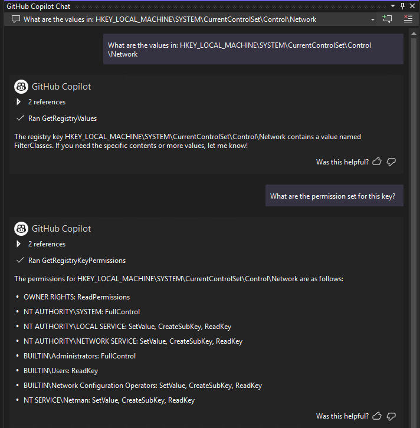

## 🎯 Overview

### ✨ What is the mcp-server-win32-registry server?

The mcp-server-win32-registry servier is a local running service that enables MCP hosts like GitHub Copilot and Cursor to search and retrieve registry information from the local machine. By implementing the standardized Model Context Protocol (MCP), this service allows any compatible AI system to read the Window registry

**Example JSON configuration:**
```json
{
    "mcp_server_win32_registry_server": {
      "type": "stdio",
      "command": "D:\\mcp-server-win32-registry\\artifacts\\Debug\\mcp-server-win32-registry-server.exe",
      "args": []
    }
}
```

### ▶️ Getting Started

1. Download the latest release and unzip the directory into a folder on your local machine.
2. Modify (Or Add) the .mcp.json file in your solution root to include the json above, for an example see: [.mcp.json](.mcp.json)
3. Open GitHub Copilot in VS Code and [switch to Agent mode](https://code.visualstudio.com/docs/copilot/chat/chat-agent-mode)
4. You should see the mcp-server-win32-registry server in the list of tools
5. Try a prompt that tells the agent to use the cp-server-win32-registry server, such as "What is the shell namespace extension installed to handle the .zip file extesnion?"
6. The agent will query the registry via  mcp-server-win32-registry server to answer your question

1. ## Latest
- [v.0.09-alpa](https://github.com/WayneWalterBerry/mcp-server-win32-registry/releases/tag/v0.0.9-alpha)

### ❓ Example Prompts

Prompt: "What is the shell namespace extension installed to handle the .zip file extension?"  

> 

Prompt: "What are the values in: HKEY_LOCAL_MACHINE\SYSTEM\CurrentControlSet\Control\Network"  

> 


## Using 
https://github.com/modelcontextprotocol

## Notes
You do not need to have the server running manually. The command specified in your .mcp.json (in this case, the path to your mcp-server-win32-registry-server.exe) will
be used by Visual Studio to automatically start the server process when needed.  The MCP server will be running on your local machine,
accessing your local Windows Registry.

Visual Studio launchs the mcp-server-win32-registry-server using the command and manage its lifecycle as required.
